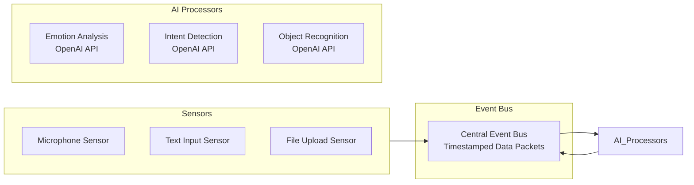

# Design Document

## Overview

The Virtual Character App is an Electron desktop application that allows users to create and interact with virtual characters. Users can upload photos and voice files to generate personalized anime-style 3D characters, then engage with them through text and voice conversations.

The system follows a **modular, test-driven architecture** with clear separation of concerns, dependency injection, and comprehensive test coverage. Each module is designed to be independently testable, replaceable, and maintainable following TDD principles.

## Architecture

### Modular Architecture Principles

The system is built on **modular design principles** with the following key characteristics:

#### 1. Separation of Concerns
- **Sensors**: Handle data collection only
- **Event Bus**: Manages communication between modules
- **Processors**: Focus on specific AI processing tasks
- **Services**: Encapsulate business logic
- **UI Components**: Handle presentation and user interaction

#### 2. Dependency Injection
```typescript
interface ServiceContainer {
  register<T>(token: string, implementation: T): void
  resolve<T>(token: string): T
  registerSingleton<T>(token: string, factory: () => T): void
}

// Example usage
container.register('EventBus', new EventBusImpl())
container.register('OpenAIService', new OpenAIServiceImpl(apiKey))
container.register('CharacterService', new CharacterServiceImpl(
  container.resolve('EventBus'),
  container.resolve('OpenAIService')
))
```

#### 3. Interface-Based Design
Every major component implements well-defined interfaces, enabling:
- Easy mocking for testing
- Runtime service replacement
- Plugin architecture for third-party integrations
- Clear contracts between modules

#### 4. Event-Driven Communication
Modules communicate through events rather than direct coupling:
- Loose coupling between components
- Easy to add new processors or sensors
- Testable message flows
- Scalable architecture

### Test-Driven Development (TDD) Approach

The entire system follows **TDD principles**:

#### 1. Red-Green-Refactor Cycle
```typescript
// Example TDD workflow for EmotionProcessor
describe('EmotionProcessor', () => {
  it('should detect happiness from positive text', async () => {
    // RED: Write failing test first
    const processor = new EmotionProcessor(mockOpenAIService)
    const result = await processor.analyzeTextSentiment({ text: 'I am so happy!' })
    expect(result.emotion).toBe('happiness')
    expect(result.confidence).toBeGreaterThan(0.8)
  })
})

// GREEN: Implement minimal code to pass
// REFACTOR: Improve code quality while keeping tests green
```

#### 2. Test-First Design
- Write tests before implementation
- Tests define the API and behavior
- Implementation follows test requirements
- Ensures 100% test coverage

#### 3. Testable Architecture
```typescript
// Dependency injection enables easy testing
class CharacterService {
  constructor(
    private eventBus: EventBus,
    private apiService: OpenAIService,
    private storage: StorageService
  ) {}
  
  // Methods are easily testable with mocked dependencies
}

// Test with mocks
const mockEventBus = new MockEventBus()
const mockAPI = new MockOpenAIService()
const mockStorage = new MockStorageService()
const service = new CharacterService(mockEventBus, mockAPI, mockStorage)
```

### Core Architecture

The system uses a sensor-bus-processor pattern for handling user inputs and AI processing:



### Technology Stack

- **Framework**: Electron (latest stable version)
- **Frontend**: React 18+ with TypeScript
- **UI Components**: shadcn/ui for modern, accessible component library
- **Styling**: Tailwind CSS (integrated with shadcn/ui)
- **State Management**: React Context API + useReducer for complex state
- **Event System**: Custom Event Bus with WebSocket-like messaging
- **AI Integration**: OpenAI API for emotion detection, object recognition, and LLM
- **3D Rendering**: Three.js with React Three Fiber for anime-style character display
- **Voice Processing**: Web Audio API + third-party voice cloning APIs
- **Character Generation**: Third-party APIs for anime-style 3D model generation
- **Data Storage**: SQLite for local character data persistence
- **Real-time Processing**: Web Workers for non-blocking AI processing
- **Data Encryption**: Built-in encryption for API communications
- **Build Tools**: Vite for fast development and building
- **Package Management**: npm or yarn

## Components and Interfaces

### Core Components

#### Sensor Layer
```typescript
interface BaseSensor {
  id: string
  type: SensorType
  isActive: boolean
  start(): Promise<void>
  stop(): Promise<void>
  publishData(data: SensorData): void
}

interface MicrophoneSensor extends BaseSensor {
  captureAudio(): Promise<AudioData>
  detectSpeech(): Promise<SpeechEvent>
}

interface TextInputSensor extends BaseSensor {
  captureText(input: string): TextData
}

interface FileUploadSensor extends BaseSensor {
  processImageFile(file: File): Promise<ImageData>
  processAudioFile(file: File): Promise<AudioData>
}
```

#### Central Event Bus
```typescript
interface EventBus {
  subscribe(eventType: string, callback: EventCallback): string
  unsubscribe(subscriptionId: string): void
  publish(event: TimestampedEvent): void
  getEventHistory(timeRange: TimeRange): TimestampedEvent[]
}

interface TimestampedEvent {
  id: string
  timestamp: Date
  type: string
  source: string
  data: any
  metadata: EventMetadata
}
```

#### AI Processors
```typescript
interface AIProcessor {
  id: string
  type: ProcessorType
  subscribe(eventBus: EventBus): void
  process(data: any): Promise<ProcessedInsight>
  publishInsight(insight: ProcessedInsight): void
}

interface EmotionProcessor extends AIProcessor {
  analyzeEmotion(audioData: AudioData): Promise<EmotionInsight>
  analyzeTextSentiment(textData: TextData): Promise<SentimentInsight>
}

interface IntentProcessor extends AIProcessor {
  detectIntent(input: string | AudioData): Promise<IntentInsight>
  extractEntities(input: string): Promise<EntityInsight>
}
```


### Core System Components

#### Character Generation Service
```typescript
interface CharacterGenerationService {
  generateFromImage(imageFile: File): Promise<AnimeCharacterModel>
  cloneVoice(audioFile: File): Promise<VoiceProfile>
  createCharacterProfile(image?: AnimeCharacterModel, voice?: VoiceProfile): Promise<CharacterProfile>
  getDefaultCharacter(): Promise<AnimeCharacterModel>
  getDefaultVoice(): Promise<VoiceProfile>
}
```

#### 3D Presentation Layer
```typescript
interface PresentationLayer {
  renderCharacter(character: VirtualCharacter): void
  updateExpression(emotion: EmotionType): void
  playAnimation(animation: AnimationType): void
  updateEnvironment(context: EnvironmentalContext): void
  subscribeToActions(actionBus: ActionBus): void
}
```

## Data Models

### Core Character Models

#### Character Profile
```typescript
interface CharacterProfile {
  id: string
  name: string
  createdAt: Date
  lastModified: Date
  
  // Generated content from third-party APIs
  imageData: {
    originalPath: string
    generatedModelPath: string
    apiResponse: ThirdPartyAPIResponse
  }
  voiceData: {
    originalPath: string
    clonedVoiceProfile: VoiceProfile
    apiResponse: VoiceAPIResponse
  }
  
  // Basic preferences
  preferences: UserPreferences
}
```

#### Virtual Character
```typescript
interface VirtualCharacter {
  profile: CharacterProfile
  currentState: CharacterState
  model: THREE.Object3D
  isActive: boolean
}

interface CharacterState {
  currentExpression: EmotionType
  currentAnimation: AnimationType
  lastInteraction: Date
}
```

### Conversation Models

#### Conversation Entry
```typescript
interface ConversationEntry {
  id: string
  timestamp: Date
  type: 'user' | 'character'
  content: string
  inputMethod: 'text' | 'voice'
  
  // AI insights
  detectedEmotion?: EmotionInsight
  detectedIntent?: IntentInsight
  
  // Character response data
  characterEmotion?: EmotionType
  responseConfidence?: number
}
```

### AI Processing Models

#### Sensor Data Models
```typescript
interface SensorData {
  id: string
  timestamp: Date
  source: string
  type: SensorType
  rawData: any
  metadata: SensorMetadata
}

interface AudioData extends SensorData {
  audioBuffer: ArrayBuffer
  duration: number
  sampleRate: number
  channels: number
}

interface TextData extends SensorData {
  text: string
  language?: string
  confidence?: number
}

interface ImageData extends SensorData {
  imageBuffer: ArrayBuffer
  format: string
  dimensions: { width: number; height: number }
}
```

#### AI Insight Models
```typescript
interface ProcessedInsight {
  id: string
  timestamp: Date
  processorId: string
  sourceEventId: string
  type: InsightType
  confidence: number
  data: any
}

interface EmotionInsight extends ProcessedInsight {
  emotion: EmotionType
  intensity: number
  valence: number // positive/negative
  arousal: number // calm/excited
}

interface IntentInsight extends ProcessedInsight {
  intent: string
  entities: Entity[]
  confidence: number
  context: string[]
}
```


## Error Handling

### Error Categories

1. **Sensor and Processing Errors**
   - Sensor initialization failures
   - Event bus communication errors
   - OpenAI API rate limiting and outages
   - Real-time processing latency issues
   - Audio device access problems

2. **Third-Party API Errors**
   - Character generation API failures
   - Voice cloning service outages
   - Network connectivity issues
   - API authentication failures
   - Service rate limiting

3. **System Integration Errors**
   - File processing failures
   - Database corruption
   - 3D rendering crashes
   - Memory leaks in long-running sessions
   - Cross-platform compatibility issues

### Error Handling Strategy

```typescript
interface ErrorHandler {
  // Core error handling
  handleSensorError(error: SensorError): Promise<SensorRecovery>
  handleAPIError(error: APIError): Promise<APIRecovery>
  handleThirdPartyError(error: ThirdPartyError): Promise<ThirdPartyRecovery>
  handleSystemError(error: SystemError): Promise<SystemRecovery>
  logError(error: Error, context: ErrorContext): void
  showUserFriendlyMessage(error: Error, suggestions: string[]): void
}

interface ErrorRecoveryStrategy {
  retryAttempts: number
  backoffStrategy: 'linear' | 'exponential'
  fallbackAction: FallbackAction
  userNotification: UserNotification
  systemStatePreservation: boolean
}
```

### Recovery Mechanisms

#### Graceful Degradation
- Continue with reduced sensor input when some sensors fail
- Use fallback responses when AI processing is unavailable
- Maintain basic functionality during API outages

#### Automatic Recovery
- **API Failures**: Exponential backoff retry with circuit breaker pattern
- **Processing Errors**: Fallback to simpler processing algorithms
- **Network Issues**: Automatic reconnection attempts

#### State Preservation
- **Conversation Continuity**: Maintain conversation state during errors
- **Character State**: Preserve character appearance and settings
- **User Progress**: Protect user data and preferences

#### User Communication
- **Transparent Errors**: Clear explanation of what went wrong
- **Recovery Status**: Real-time updates on recovery attempts
- **Alternative Actions**: Suggest alternative ways to continue interaction

## Testing Strategy

### Core System Testing

#### Sensor and AI Testing
```typescript
interface SensorTestSuite {
  testSensorInitialization(): Promise<TestResult>
  testEventBusMessaging(): Promise<TestResult>
  testAIProcessorIntegration(): Promise<TestResult>
  testRealTimeProcessing(): Promise<TestResult>
  testOpenAIAPIIntegration(): Promise<TestResult>
}
```

**Test Coverage:**
- Sensor data collection and validation
- Event bus message routing and timing
- AI processor response accuracy and latency
- OpenAI API integration and error handling
- Real-time processing under load

### Core System Testing

#### Unit Testing
- **Sensor Components**: Individual sensor functionality and data validation
- **Event Bus**: Message routing, subscription management, and event history
- **AI Processors**: Emotion detection, intent recognition, and insight generation
- **Character Generation**: Third-party API integration and response handling
- **3D Rendering**: Model loading, animation, and expression updates

#### Integration Testing
- **Sensor-Bus-Processor Pipeline**: End-to-end data flow from sensors to insights
- **API Integration**: Third-party service communication and error handling
- **Database Operations**: Character profile storage and retrieval
- **Component Communication**: Data flow between different system components

#### End-to-End Testing
- **Character Creation Workflow**: Complete process from file upload to character generation
- **Conversation Flow**: Basic text and voice conversations
- **Error Recovery**: System behavior during API failures and network issues
- **Session Continuity**: State preservation across application restarts

### Performance Testing

#### Real-Time Performance
```typescript
interface PerformanceMetrics {
  sensorLatency: number // < 100ms
  aiProcessingTime: number // < 500ms
  responseGenerationTime: number // < 1000ms
  renderingFrameRate: number // > 30fps
}
```

**Performance Benchmarks:**
- Sensor data processing latency
- AI insight generation time
- LLM response generation speed
- 3D rendering frame rate stability
- Memory usage optimization

#### Load Testing
- **Concurrent Processing**: Multiple AI processors running simultaneously
- **API Rate Limiting**: Handling OpenAI API rate limits gracefully
- **Long-Running Sessions**: Memory leaks and performance degradation over time

### AI Quality Testing

#### Conversation Quality Metrics
```typescript
interface ConversationQualityMetrics {
  responseRelevance: number
  emotionalAppropriateness: number
  responseCoherence: number
}
```

**Quality Assurance:**
- Response relevance and coherence
- Emotional appropriateness detection
- Character response consistency

### Test Framework and Tools

#### Testing Infrastructure
- **Unit Tests**: Jest with TypeScript support for component testing
- **Integration Tests**: Custom test harness for multi-component workflows
- **E2E Tests**: Playwright for full application testing
- **Performance Tests**: Custom benchmarking suite with metrics collection
- **AI Quality Tests**: Specialized evaluation framework for conversation quality

#### Mock and Simulation
```typescript
interface TestMocks {
  mockOpenAIAPI: MockOpenAIService
  mockVoiceCloningAPI: MockVoiceService
  mockCharacterGenerationAPI: MockCharacterService
  mockUserInteractions: UserSimulator
  mockSensorData: SensorDataGenerator
}
```

#### Continuous Testing
- **Automated Test Runs**: CI/CD pipeline with comprehensive test coverage
- **Performance Regression Detection**: Automated performance benchmark comparison
- **AI Quality Monitoring**: Continuous evaluation of conversation quality metrics
- **Cross-Platform Testing**: Automated testing on Windows and macOS

### Test Data Management

#### Synthetic Data Generation
- **Conversation Datasets**: Generated conversation flows for testing memory and learning
- **Sensor Data Simulation**: Synthetic audio, text, and image data for sensor testing
- **User Behavior Patterns**: Simulated user interaction patterns for learning tests
- **API Response Mocking**: Comprehensive mock responses for third-party APIs

#### Privacy-Compliant Testing
- **Anonymized Data**: Use anonymized conversation data for testing
- **Synthetic Voice Samples**: Generated voice data for voice processing tests
- **Generic Image Assets**: Non-personal images for character generation testing
- **Data Encryption Testing**: Verify encryption of sensitive test data